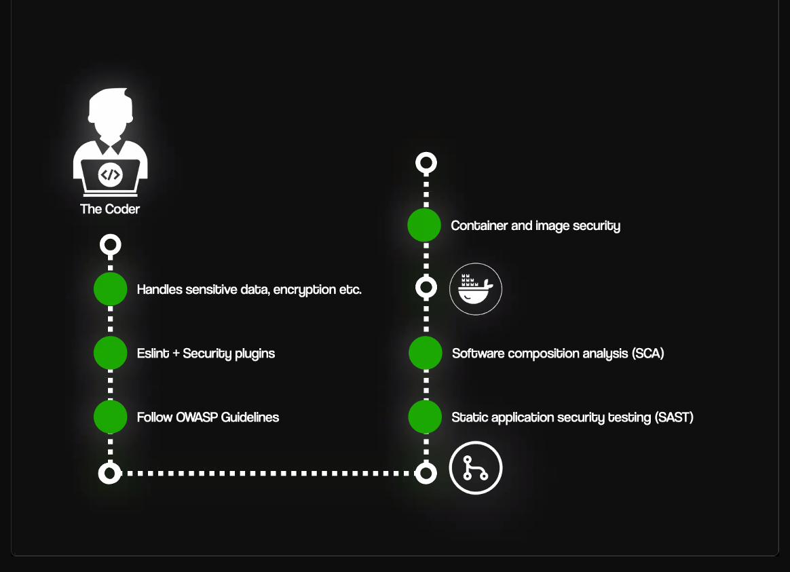

1. DevOps
2. DevSecOps(at every stage we focus more on security)
3. CI/CP pipelines 
4. Follow OWASP guidelines
5. Static appplication security testing (SAST) after pushing on github
6. Software composition analysis (SCA)
7. what is pipelines, how to write pipelines
8. Dynamic application security testing(DAST)
9. zap application
10. Kernal(what is kernal): kernal alwasy talks to hardwares.
It is the primary part of the operating system. When a system gets booted, Kernel is the first part of the OS which gets loaded into the RAM for your system to start working. It is the core interface between a computer's hardware and its processes aka applications to use the hardware.

11. what is the main difference between OS and kernal?
12. what is distros or distribution of linux? (ubuntu, mint, garuda)
13. how android uses linux kernal to make os.
14. what is redix ui.
15. how redix ui is made, then how shadcn is made using radix ui.
16. why linux is used for servers?
17. Virtual Machines(VMs): examples.
18. How can I make my machine virtual so that my friend can use my machine.(on linux and windows)
19. Hypervisor software: it is used to make possible virtualization on a machine. or do logical partitioning.
20. Hypervisor has two types: 1. Type 1 -> bare metal
                              2. Type 2 -> 
21. What is dual booting.
22. what is WSL2
23. what is SSH AND HOW TO USE IT
24. what is firewalls
25. how http, https, and ssh works to connectt.
26. IPv4 and IPv6 and why do we required ip address.

victor mono